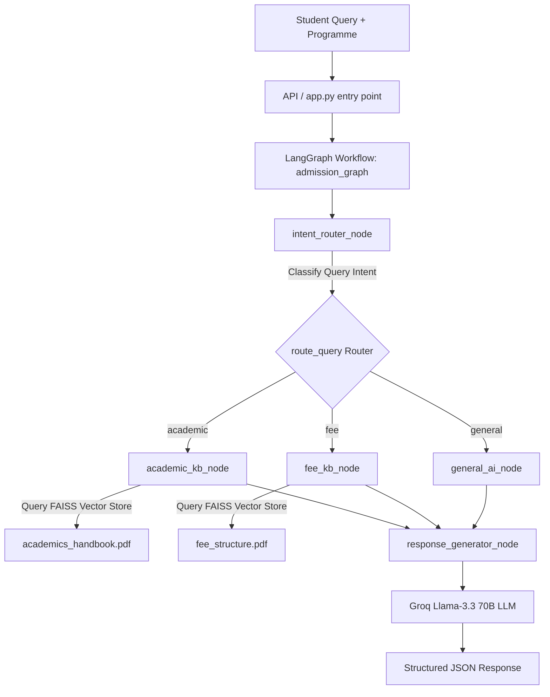

# Admitra - AI College Admission & Academic Assistant

> A production-ready, modular LangGraph RAG (Retrieval-Augmented Generation) backend designed to deliver accurate, context-aware answers to student queries regarding academic handbooks, fee structures, and general inquiries.

---

## 📌 Project Overview

**Admitra** is an enterprise-grade AI chatbot system built with **LangGraph**, **LangChain**, **Groq (Llama 3.3)**, and **FAISS**. It intelligently routes student questions based on intent classification to specialized PDF knowledge bases (e.g., Academic Regulations vs. Fee Structure documents) or falls back to general AI conversational capabilities.

---

## ✨ Features

- **Intent-Based Dynamic Routing**: Automatically classifies queries into `academic`, `fee`, or `general` categories.
- **Context-Aware Retrieval (RAG)**: Retrieves pinpoint context chunks from vectorized PDF handbooks using FAISS & HuggingFace sentence-transformers.
- **Programme Personalization**: Tailors answers dynamically according to the student's degree programme (e.g., BCA, BBA, B.Com).
- **Structured JSON API**: Exposes a clean, UI-ready `chat()` interface returning responses, classified intent, source PDF page numbers, and execution telemetry.
- **Node-Level Telemetry Logging**: Records execution timestamps, latency (ms), routing decisions, and retrieved document counts across every graph node.
- **Modular & Extensible Architecture**: Strictly follows the Single Responsibility Principle (SRP) with isolated config, LLM, RAG, graph, and API layers.

---

## 📐 Architecture Diagram



---

## 📁 Folder Structure

```
Admitra/
├── backend/
│   ├── app.py                  # Primary application programmatic interface (chat)
│   ├── config/
│   │   ├── __init__.py
│   │   └── settings.py         # Centralized configuration & environment variables
│   ├── llm/
│   │   ├── __init__.py
│   │   └── groq_client.py      # Groq Chat model setup
│   ├── rag/
│   │   ├── __init__.py
│   │   ├── embeddings.py       # HuggingFace sentence-transformers embeddings
│   │   ├── retriever.py        # PDF document retrievers (Academic & Fee)
│   │   └── vectorstore.py      # PDF loader & FAISS index creation
│   ├── graph/
│   │   ├── __init__.py
│   │   ├── admission_graph.py  # LangGraph StateGraph assembly & compilation
│   │   ├── nodes.py            # Graph node implementations & telemetry
│   │   ├── router.py           # Intent-based conditional router logic
│   │   └── state.py            # TypedDict state schema definition
│   ├── api/
│   │   ├── __init__.py
│   │   └── routes.py           # Pydantic models & FastAPI handler interface
│   ├── utils/
│   │   ├── __init__.py
│   │   └── logger.py           # Structured node telemetry logger
│   └── data/
│       ├── academics_handbook.pdf
│       └── fee_structure.pdf
├── admission_workflow.py       # CLI runner wrapper for testing
├── requirements.txt            # Python dependencies
└── README.md                   # Repository documentation
```

---

## 🚀 Installation & Setup

### 1. Prerequisites
- Python 3.10+
- Groq API Key ([Get an API key from Groq Console](https://console.groq.com/))

### 2. Clone & Setup Virtual Environment
```bash
git clone https://github.com/your-username/Admitra.git
cd Admitra

python3 -m venv .venv
source .venv/bin/activate
pip install -r requirements.txt
```

### 3. Configure Environment Variables
Create a `.env` file in the root directory:
```env
GROQ_API_KEY=your_groq_api_key_here
GROQ_MODEL_NAME=llama-3.3-70b-versatile
LLM_TEMPERATURE=0.4
```

---

## 💻 Example API Usage

```python
import json
from backend.app import chat

# Execute a query for a BCA student
response = chat(
    programme="BCA",
    message="What is the minimum attendance required to appear for exams?"
)

print(json.dumps(response, indent=2))
```

### Example JSON Response Output:
```json
{
  "answer": "For BCA students, the minimum required attendance is 75% across all courses to be eligible for end-term examinations.",
  "query_type": "academic",
  "retrieved_sources": [
    {
      "source": "data/academics_handbook.pdf",
      "page": 4
    }
  ],
  "debug_logs": [
    {
      "node_name": "intent_router",
      "timestamp": "2026-08-06T20:21:00.123456+00:00",
      "latency_ms": 320.15,
      "routing_decision": "academic",
      "retrieved_chunk_count": 0
    },
    {
      "node_name": "academic_kb",
      "timestamp": "2026-08-06T20:21:00.450123+00:00",
      "latency_ms": 115.42,
      "routing_decision": null,
      "retrieved_chunk_count": 4
    },
    {
      "node_name": "response_generator",
      "timestamp": "2026-08-06T20:21:01.100200+00:00",
      "latency_ms": 645.88,
      "routing_decision": null,
      "retrieved_chunk_count": 0
    }
  ]
}
```

---

## 📸 Screenshots & UI Integrations

*(Insert UI screenshots, Streamlit dashboard previews, or frontend interaction captures here)*

| Interactive Chat UI | Telemetry & Sources View |
|:---:|:---:|
|  |  |

---

## 🛣️ Future Roadmap

- [ ] **Multi-turn Memory Persistence**: Add Redis / Postgres checkpointer for persistent user sessions.
- [ ] **FastAPI Web Server**: Expose `/api/v1/chat` REST endpoint via FastAPI.
- [ ] **Next.js / React Frontend**: Build a modern web chat UI with glassmorphism design.
- [ ] **Hybrid Search**: Combine BM25 keyword search with FAISS dense embeddings for enhanced retrieval recall.
- [ ] **Multi-Modal Document Processing**: Ingest tables and image diagrams using Unstructured / LlamaParse.

---

## 📄 License
Distributed under the MIT License. See `LICENSE` for details.
